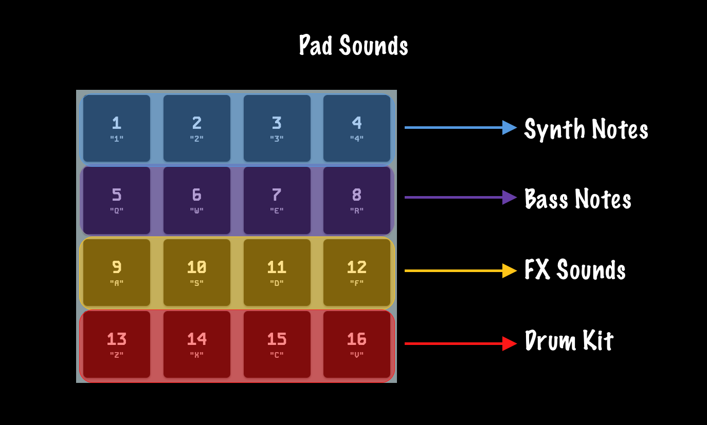

# QWRT-SEQ-20

The Goal of this project is to bring an old-school philosophy of making drum machines as simple to get started and play as possible to web technology. Making something that is just one link away from creating something awesome.

16 pads, intuitive keybinding, of the box sounds and endless creative possibilities is the ultimate goal.

## History

The evolution of drum machines has had a profound impact on music production, inspiring the creation of this drum machine app. While many physical devices have shaped the landscape, a few iconic names stand out as monumental influences.

### The MPC Revolution

The Akai MPC (Music Production Center) series, introduced in the late 1980s, transformed beat-making by merging sampling, sequencing, and pad-based performance. The MPC 60, designed with Roger Linn, featured 12-bit sampling and became a hip-hop staple for its warm, gritty sound and intuitive workflow. The MPC 3000, with 16-bit sampling and expanded features, defined the golden era of hip-hop, used by icons like Dr. Dre and DJ Premier.

The MPC 2000 and 2000XL, released in the late 1990s, further democratized music production with features like time-stretching and sample zoning, pivotal for hip-hop and electronic genres. The MPC’s velocity-sensitive pads and streamlined design influenced the evolution of modern drum machines, cementing its status as a cornerstone of contemporary music production.

Mpc 60             |  Mpc2000
:-------------------------:|:-------------------------:
  |  

### The Roland Underground

The Roland TR-808 and TR-909 drum machines revolutionized music production in the 1980s, defining genres like hip-hop, house, and techno with their iconic sounds and programmable sequences. They laid the foundation for modern beatmaking and remain staples in electronic music.

Roland’s SP-series samplers—especially the SP-202, SP-303, and SP-404—expanded this legacy. The SP-202 introduced accessible sampling, while the SP-303, made famous by producers like J Dilla, added effects and a warm, lo-fi character. The SP-404 further innovated with live performance tools and resampling workflows, becoming essential for lo-fi hip-hop and experimental producers. Together, these tools shaped modern music’s sound and creative processes.

TR-808             |  SP302 | SP404
:-------------------------:|:-------------------------: | :-------------------------:
  |   | 

### The MIDI Companions and VSTs

As MIDI technology advanced, hardware drum machines integrated seamlessly with other gear and computers, paving the way for digital production. Virtual Studio Technology (VST) plugins allowed producers to emulate classic drum machines and samplers within software, offering limitless customization without physical hardware. This innovation expanded the creative potential of modern music-making.

The rise of Digital Audio Workstations (DAWs) like Logic Pro, FL Studio, and Ableton Live further transformed production. These platforms combined MIDI controllers with powerful sequencing, sampling, and editing tools. Features like FL Studio’s step sequencer and Logic’s Drum Machine Designer streamlined beat-making, bridging the gap between tactile performance and digital versatility, and ensuring the enduring influence of drum machines and samplers. A personal favorite is Koala Sampler

Koala Sampler             |  FlStudio Drum Machine 
:-------------------------:|:-------------------------:
  |   | 

### The Huge Market

The popularity of drum machines has exploded, with a wide range of options for both hardware and software available today. From portable, budget-friendly devices to sophisticated DAW-integrated software, the market now offers tools for every type of producer. This widespread availability has democratized beat-making, and this drum machine app continues that tradition by offering an accessible, powerful, and creative tool for everyone.

## Direct Inspirations 

In design and feel I had to go with what I know best and that is the 16 pad layout. Which I find both easy to use to sequence and intuitive to perform live.

My main hardware inspiration include the mpc2000, mpc500, the sp404mk2, the teenage engineering po-33 and other 16 pad sampler designs. 
On the software side I leaned on my familiarity with Koala Sampler and the VST's in Logic Pro and FlStudio  

**Design Inspiration Board**

 

## User Stories

### Casual Live Playing 

This user opens the drum machine website with the intention of quickly jumping into playing some beats. They aren’t looking to tweak complex settings, create advanced loops, or spend time configuring custom kits. Instead, they want to instantly have access to playable drum sounds via the keyboard or mouse, and feel like they can just start making rhythms within seconds. Whether they have five minutes or an hour to spare, the drum machine should offer them a frictionless experience.

**User Requirements:**

- simple and quick to use
    - The interface should be clean and minimal, with no unnecessary clutter or overwhelming options. A clear, recognizable set of drum pads should be prominently displayed, making it immediately obvious how to play sounds.
    - No sign-up, registration, or complicated menus. The user should be able to start playing with as few clicks as possible. Ideally, they should be able to make their first sound within 2-3 seconds of loading the site.
- intuitive keybinding 
- out of the box sounds
    - basic drum sounds (kick, snare, hat, crash), sound effects, bass notes and synth keys
- clear visual feedback\
    - Every action the user takes should result in immediate and clear visual feedback. For example, when they press a key or click a pad, the corresponding drum pad should light up or animate in some way, making it obvious that the input has been registered.

**Key Goals:**

- Immediate playability within seconds of page load.
- Intuitive controls and interactions, especially through keyboard and/or mouse.
- Fun and relaxing experience, providing a frictionless creative outlet.

### Casual/Amateur Sequence Making

This user visits the drum machine website with the intention of not just tapping out beats, but also crafting a sequence that loops over time. They want to explore how different sounds fit together and enjoy making tweaks to their patterns using built-in effects. This user might still be relatively new to music production or simply want to explore different possibilities by creating sequences, experimenting with filters, volume, or adding distortion. They value a playful and exploratory environment where they can easily build, modify, and trigger sequences.

**User Requirements:**

- all the previous
    - Everything from the Casual Live Playing user story must still be available: a simple interface, intuitive keybinding, and high-quality out-of-the-box sounds.
    - The user should be able to seamlessly move from live playing into sequence making, with the same intuitive controls and sound options.
- sequence making
- sequence editing 
- bus effects
    - all pads go through the main effects and can be edited (volume, filter and distortion)
- pad specific effects
    - pads can be individually muted, soloed, change volume
    - This allows the user to create dynamic compositions where, for example, they might mute the kick for a few bars or solo the a pad to create a transition
- each pad has two sequences (A and B)
    - For a more dynamic performance, each drum pad should be capable of holding two sequences: A and B. These two sequences can be triggered independently, allowing the user to switch between different rhythms for each pad during a performance.
    - This feature is perfect for creating variation during live performances or when making longer compositions. For example, the user could create a simpler kick pattern for sequence A and a more complex variation for sequence B, switching between them as needed for transitions or builds in their song.
    - The user should be able to switch between the A and B sequences seamlessly during playback, ensuring smooth transitions for live performance or recording.

**Key Goals:**

- Provide tools for creating structured drum sequences in a user-friendly, visual interface.
- Allow intuitive editing and experimentation with sequences and effects.
- Empower users to add effects and perform with sequences, encouraging creativity while keeping the experience engaging and accessible.

### First Time Drum Machine User

A first-time user visits the drum machine site out of curiosity, perhaps having heard about drum machines or beat-making but without knowing exactly how they work. This user is excited to explore, but may also feel intimidated by the unfamiliar interface. They need an experience that is welcoming, easy to understand, and guides them through the process in a way that is engaging. The experience should gradually introduce them to the various aspects of drum machines—starting with the basics of playing sounds and advancing towards creating their first simple beat

**User Requirements:**

- simple and quick to use
    - The interface should be clean and minimal, with no unnecessary clutter or overwhelming options. A clear, recognizable set of drum pads should be prominently displayed, making it immediately obvious how to play sounds.
    - No sign-up, registration, or complicated menus. The user should be able to start playing with as few clicks as possible. Ideally, they should be able to make their first sound within 2-3 seconds of loading the site.
- intuitive keybinding 
- out of the box sounds
    - basic drum sounds (kick, snare, hat, crash), sound effects, bass notes and synth keys
- instructions
    - Clear, beginner-friendly instructions should be available, explaining the basics of how to use the drum machine. These instructions should be accessible but not intrusive—users should be able to skip them if they prefer to explore on their own.
- defensive design
    - The interface should be designed to prevent the user from making mistakes or getting lost in the app. For example, buttons should have clear labels, and there should be no risk of accidentally deleting progress or getting stuck in a complicated menu.
- clear visual feedback
    - Every action the user takes should result in immediate and clear visual feedback. For example, when they press a key or click a pad, the corresponding drum pad should light up or animate in some way, making it obvious that the input has been registered.

**Key Goals:**

Provide a gentle introduction to the world of drum machines, offering guidance without overwhelming the user.
Ensure a frictionless experience that allows users to explore and experiment while maintaining a sense of control.
Offer clear, immediate feedback to help users understand how their actions affect the sounds they are creating.

## Features

### Polyphonic Play

The drum machine supports polyphonic play, allowing multiple drum pads to be triggered simultaneously. This enables users to create rich, layered rhythms and complex drum patterns by combining multiple sounds at once, whether in live play or when sequencing.

### 16-Step Editing

Create and edit drum sequences with ease using the intuitive 16-step sequencer. This step grid allows users to sounds over a 16-step timeline, perfect for building looped patterns and beats with precision. Each step represents a note, making it simple to build complex, rhythmically varied sequences. the When the user is in edit mode they can see the steps for the selected pad and they can toggle the individual steps on or off. In the image below you can see a sequence of steps for the hat pad to play on steps (1,3,5,7,9,11,13,15)

### Keybinding for Controls

The drum machine features intuitive keyboard controls for triggering drum pads and navigating the interface. Keybindings are designed to be easy to remember and use, allowing users to trigger sounds, start and stop sequences, and adjust settings without needing to rely on a mouse, making live performances and creative sessions smoother. The user has access to all the pads through the keybindings, all the control buttons to control playback and change modes and pad specific effects can also be accessed through keybindings. This allows the user to also use the multifunctional feature of the pads to play, edit and select with just the keybinding and mode combinations. these keybinding are visible to a user when in landscape mode and appear bellow the main text of the buttons or pads.

### Effects

Enhance your beats with built-in audio effects, providing creative control over the sound of your drum patterns:

- Volume: Adjust the overall loudness of each drum sound or the entire mix.
- Filter: Apply a low-pass filter to shape the frequency range of your sounds, allowing for smoother or more muffled tones.
- Distortion: Add grit and intensity to your beats by applying distortion, perfect for creating more aggressive or raw sounds.

### Individual Pad Editing

Each drum pad can be individually customized, allowing for fine-tuned control over your performance:

- Volume: Adjust the volume for each pad independently to balance your mix.
- Solo: Isolate a pad’s sound so that only it plays, allowing for focused listening or emphasizing certain elements in your performance.
- Mute: Silence any specific pad without deleting its sequence, providing flexibility in live play or composition.
- Seq A or B: allow users to switch between these two sequences for each pad

All these are accessed through the "Pad Effects" section, which is found on the far left of the drum machine in landscape mode and inside the settings modal in portrait mode (mobile). and control the currently selected pad's state

### Built-in Sounds

Get started right away with a versatile library of built-in sounds. The sound set includes basic drum kit elements such as kick, snare, hi-hats, and crash cymbals, as well as additional sound effects, bass notes, and synth keys for melodic and experimental compositions. These preloaded sounds ensure users have the tools they need to create beats across multiple genres.

The following image shows a breakdown of where each sound group is found in the 4x4 pad grid:

### Two Sequences per Sound

Each drum pad can store two separate sequences, A and B, giving users the flexibility to switch between different patterns for the same sound. This allows for dynamic changes during live performances or more complex arrangement possibilities when composing, providing more versatility in how rhythms evolve over time. This is found in the Pad Effects section

### Controls 

There is a control section in the drum machine that is populated with button that control playback 
and have certain function that can be used when making and editing sequences and playing sounds

these include:
- **Play/Pause Button**
    - allows user to start and stop sequence playback
- **Edit Mode Button**
    - allows user to enter and exit edit mode
- **Select Mode Button**
    - allows user to enter and exit select mode
- **Mute Button**
    - allows user to mute all pads during sequence playback
- **Clear Button**
    - allows user to clear every steps in every pads sequences 

### Multifunctional Pads

The drum machine's pads are designed to be versatile, offering different functionalities depending on the selected mode. This allows users to perform, edit, and manage their sequences more efficiently without needing separate controls for every action.

**Play, Edit, and Select Modes**
- PLAY Mode:
    In this mode, the pads act as live triggers for the assigned drum sounds. Users can play the pads in real time, creating rhythms and beats on the fly. The pads respond to key presses or mouse clicks, providing an immediate and intuitive way to perform.
- EDIT Mode:
    In Edit Mode, the pads transition to become part of the sequence editing interface. Users can input or modify steps in the 16-step sequencer by pressing the pads, adding or removing beats at specific points in the sequence. This mode allows for easy fine-tuning of the rhythm without switching interfaces.
- SELECT Mode:
    Select Mode allows users to choose specific pads for further editing or customization. In this mode, selecting a pad enables options for adjusting its individual settings such as volume, mute, solo, or effects, making it simple to focus on one sound at a time while refining the overall beat.

The Modes can be switched with the corresponding Button. 

By switching between these modes, the user can seamlessly transition from playing beats live to editing sequences and fine-tuning individual sounds, all through the same set of pads. This multifunctional approach streamlines the workflow and keeps the interface uncluttered.

### Responsive Design

The drum machine is designed to work seamlessly across different devices and screen sizes. The interface automatically adjusts to provide the best possible user experience, with two distinct layouts optimized for desktop and mobile. This ensures that whether you’re using a laptop, tablet, or smartphone, the drum machine remains fully functional and accessible.

For me this meant changing the layout of the drum machine based on display orientation firstly. Using Css Grid they are two major layouts for the drum machine to accommodate
the orientation. Furthermore on mobile the Pad Effects section is moved to the settings dialog to save space. Lastly the buttons, pads and text have a responsive size to look good on every device

#### Desktop/Tablet (Landscape)

#### Mobile/Tablet (Portrait)

**Setting Modal with Pad Effects**

## UI/UX

### Design Choices

The goal is to have the web app look sleek and modern but still have all the information you need in presented in a coherent.
The use should be also able to customize the background of the drum machine to their liking

### Color Palette

The main color palette for this site is defined below:

- pad-color: rgb(0, 0, 0);
- pad-color-hover: rgb(33, 33, 33);
- pad-color-active: rgb(77, 77, 77);
- container-color: #8b9b9f;
- secondary-color: #33c1ff; /* Bright Blue for interactive elements */
- background-color: #1e1e1e; /* Dark Gray for the overall background */

### Font

Google fonts was used, specifically the [Kode Mono](https://fonts.google.com/specimen/Kode+Mono) Font

This font was chosen to match the fonts on some earlier late 90s early 2000s Drum machines
and samplers as they used a dot matrix display to show textual info. This is a modern take on that

### Mockups

The basic mockups where first made to get a general view for the layout and and proportions.
As can be seen in the final product the skeleton of the Mockup was taken and expanded with additional 
features and a refined style after the basic Mockup was able to be implemented with CSS.

Initially a rough sketch was made to visual the very basic skeleton and start conceptualizing the features:

The following are the initial rough mockups for the Mobile and Desktop Designs:

| Mobile   |      Landscape/Desktop      |
|----------|:-------------:|
|  |   |
|  |       |

### Accessibility

- button hover
- feedback for button clicks and touches
- mode and current pad always shown
- keybinding for ease of use
- manual available for both mobile and desktop users 
    - [desktop manual](/assets/manuals/manual-desktop.pdf)
    - [mobile manual](/assets/manuals/manual-mobile.pdf)
- Ensuring that the background always has enough contrast with the text to make it readable
- checking for prefers-reduced-motion to disable animations for users who don't want them

#### Error Prevention

When users do an action that is not supported are goes against the programming of the drum machine
they will be shown an elegant toast at the bottom of the screen with a concise error message

- Trying to edit a pad without any being selected. This can happen when clicking the edit or any
of the pad effects before there is any pad selection made or any pad is played.

Also when users want to delete all the steps in the drum machine there is a confirm dialog to ensure
the button was not clicked by mistake

## Testing

See full testing in the [TESTING.md](./TESTING.md) file

### Known Bugs

- On a Mac if you have airpods connected and you start playing audio on another apple device, if you airpods are configured to automatically switch the sound won't work anymore

#### IOS device silent bug

If you try playing one of the audio files on an ios device which has been set to mute, the audio will not play
With recent ios updates the **device must not be muted for the audio to play**

## Deployment 

Deployed using Github pages. This was done through the online github portal and setting the root directory of the repository as the path for the site

Deployed site can be found in this [link](https://mattds825.github.io/qwrt-seq-20/)

-> **Steps to deploy a website using GitHub Pages**

1. Open your github repositroy
2. Open the settings
3. Select 'Pages' from the side menu
4. Select the branch you want to deply from the dropdown

Concise steps can be found [here](https://www.codecademy.com/article/f1-u3-github-pages)

## Local Development

### How to Fork

1. Log in or Create a GitHub account
2. go the repository page [github.com/Mattds825/qwrt-seq-20](https://github.com/Mattds825/qwrt-seq-20)
3. click the fork button 

Concise steps can be found [here](https://docs.github.com/en/pull-requests/collaborating-with-pull-requests/working-with-forks/fork-a-repo) 

### How to Clone

1. Open the folder where you would like to clone the project
2. Open a terminal window
3. Enter the following command: <code>git clone https://github.com/Mattds825/qwrt-seq-20.git</code>

Concise steps can be found [here](https://github.com/git-guides/git-clone)

### How to run Locally

You can either open the html file in your browser of choice, or you can use a vscode plugin such as
live server or live preview

## Credits 

### Tools and Technologies Used 

I tried to keep the stack as minimal as possible, opting to use vanilla JS and 
Tone js as the 3rd party library to handle the audio engine functionality

- HTML/CSS/Javascript 
- vanilla JS (no framework)
- all css from scratch 
- [Tone.js](https://tonejs.github.io) : third part library for audio processing
- [Toastify.js](https://github.com/apvarun/toastify-js/tree/master) : used to create elegant error messages 
- [Sketch](https://www.sketch.com): Used to create mockups and user manuals  
- [FontAwesome](https://fontawesome.com) : Used for the icons
- ChatGpt - Used to research and create expand paragraphs about the history of drum machines. Also used to fix grammar, spelling and improve writing presentation
- Github - Used and CI tool 
- Github pages - Used for deployment

### Code and Resources Used

- [Tone.js Docs](https://tonejs.github.io/docs/14.7.39/index.html) Used to understand the API and use some examples as starting point

- [MDN Docs](https://developer.mozilla.org/en-US/docs/Web/JavaScript) Used for all javascript documentation needs

- [redketchup.io](https://redketchup.io/favicon-generator) used to generate favicon

 - this [solution](https://github.com/Tonejs/Tone.js/issues/767) was used to fix the audio not playing when source changed: 

 - [mdm doc multi-touch](https://developer.mozilla.org/en-US/docs/Web/API/Touch_events/Multi-touch_interaction) and this
 [stack overflow page](https://stackoverflow.com/questions/2915833/how-to-check-browser-for-touchstart-support-using-js-jquery)
 used as resources to fix the multi touch issues on touch capable devices

## TODO 

- add elegant error handling

- add visually imparied features
    - voice with mode
    - errors with voice

- JS, CSS, HTML validation 

- unit testing